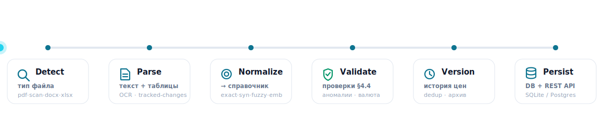
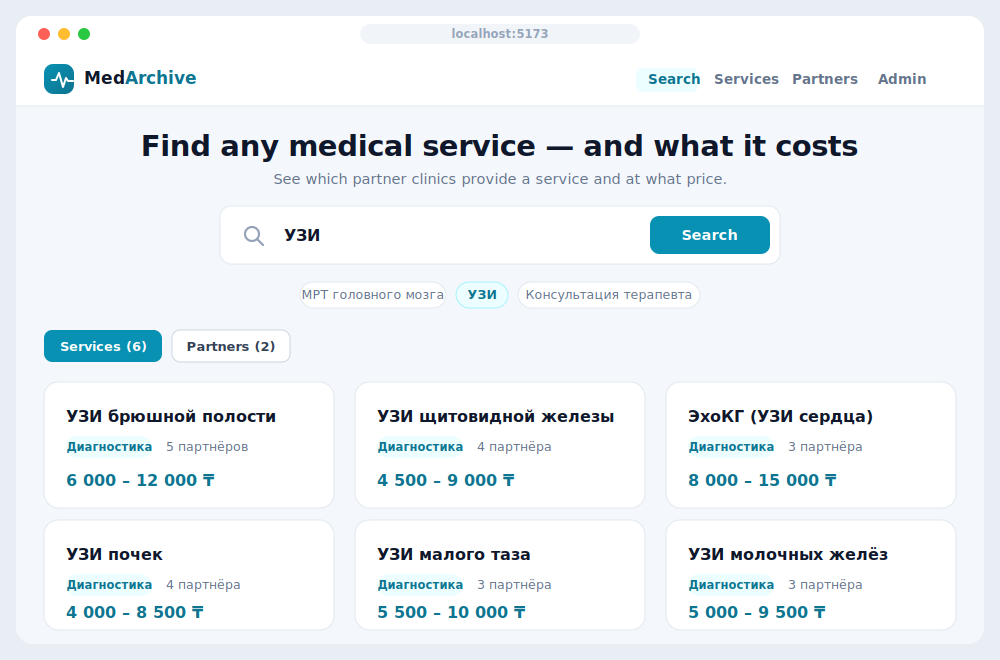
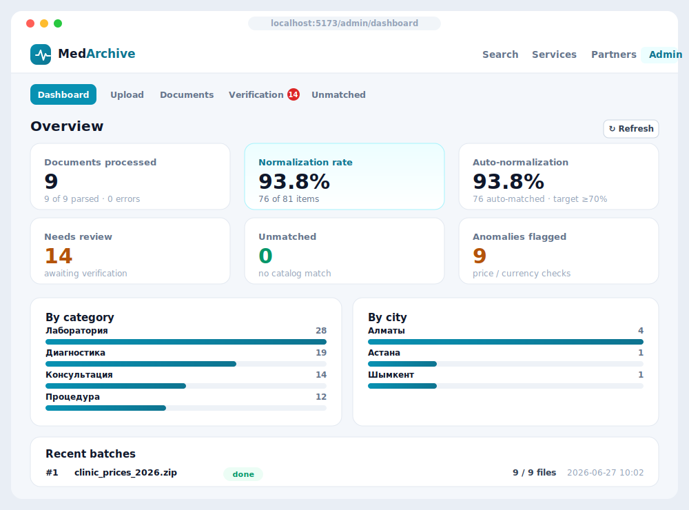
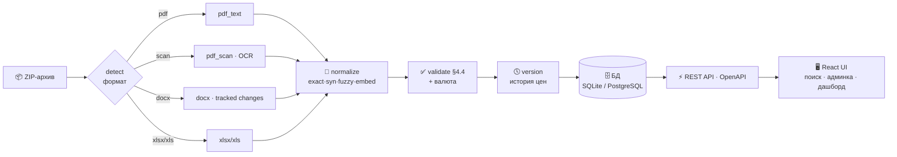

<!-- ╔══════════════════════════════════════════════════════════════════════╗ -->
<!-- ║                           MedArchive — README                          ║ -->
<!-- ╚══════════════════════════════════════════════════════════════════════╝ -->

<div align="center">



<br/>

<!-- tech badges -->


<!-- achievement badges -->

-0e7490?style=for-the-badge)


### Автоматическая обработка архива прайс-листов клиник-партнёров
**PDF · скан (OCR) · DOCX (tracked changes) · XLSX/XLS → нормализация → версии цен → REST API + веб-интерфейс**

[**🚀 Быстрый старт**](#-быстрый-старт-за-3-команды) ·
[**🏗 Архитектура**](#-архитектура) ·
[**🔌 API**](#-rest-api) ·
[**📊 Результаты**](#-результаты-обработки-make-report) ·
[**🎯 Критерии оценки**](#-соответствие-критериям-оценки-8)

</div>

---

## 💡 Проблема и решение

> Клиники-партнёры присылают прайсы в **разном виде**: текстовые PDF, **сканы**, Excel с
> несколькими листами, Word с правками. Цены меняются, валюты разные, названия услуг
> у всех свои. Свести это вручную в единую базу «кто, какую услугу и за сколько» — долго
> и дорого.

**MedArchive** делает это автоматически: принимает ZIP-архив, распознаёт каждый файл,
извлекает услуги и цены (резидент/нерезидент), приводит названия к **единому справочнику**,
проверяет, версионирует историю цен и отдаёт всё через **REST API** и **веб-интерфейс**.

<div align="center">

| 🎯 **93.8%** | 🗂 **5 форматов** | 🧾 **9 документов** | 🧠 **4-уровневый** | 🕓 **∞ история** |
|:---:|:---:|:---:|:---:|:---:|
| авто-нормализация<br/>(цель ТЗ ≥70%) | PDF · скан · DOCX · XLSX · XLS | разобрано в демо-архиве | каскад сопоставления | версионирование цен |

</div>

---

## 🎬 Как это работает

<div align="center">

</div>

ZIP-архив распаковывается, каждый файл попадает в очередь (`PriceDocument`), а фоновый
воркер прогоняет его через конвейер: **определение формата → парсинг → нормализация →
валидация → версионирование → запись в БД**. Ядро общается только с контрактами
(`BaseParser`, `MatchResult`, `ValidationOutcome`), поэтому **новый формат добавляется
без изменения ядра** (НФТ §5).

---

## 🧠 Нормализация: каскад сопоставления

Каждая сырая строка прайса проходит каскад «дёшево → дорого», который **останавливается на
первом уверенном совпадении**. Порог авто-сопоставления конфигурируется
(`MATCH_AUTO_THRESHOLD`, по умолчанию **0.85**); «серая зона» уходит в очередь
`needs_review`, совсем непохожее — в `unmatched`.

<div align="center">

</div>

| Уровень | Метод | Когда срабатывает |
|---|---|---|
| 1️⃣ **Exact** | точное совпадение нормализованной строки | идентичные названия |
| 2️⃣ **Synonym** | словарь синонимов из справочника | «ОАК» → «Общий анализ крови» |
| 3️⃣ **Fuzzy** | RapidFuzz token-set ratio | опечатки, перестановки слов |
| 4️⃣ **Embedding** | multilingual-e5 (cosine) | смысловая близость на ru/kz |

> Эмбеддинги загружаются **офлайн** из локального кэша (`make bake-model`). Без него
> матчер изящно деградирует до лексической цепочки — демо всё равно работает.

---

## 🖥 Интерфейс

<table>
<tr>
<td width="50%"></td>
<td width="50%"></td>
</tr>
<tr>
<td align="center"><b>🔎 Поиск</b> — услуга → партнёры с ценами резидент/нерезидент</td>
<td align="center"><b>📊 Дашборд</b> — метрики качества, очереди, распределения</td>
</tr>
</table>

Плюс: **страница партнёра** (полный прайс + контакты + даты), **загрузка архива**,
**статус обработки документов**, **очередь верификации** и **очередь несопоставленных**
для ручной разметки оператором.

---

## 🤖 AI-ассистент (чат-бот)

> Пользователь пишет предпочтения **обычным языком** — ассистент анализирует текст и
> мгновенно отдаёт релевантные результаты из распарсенной базы.

Новая вкладка **«Assistant»** (`/assistant`, endpoint `POST /api/assistant/chat`).
Пользователь формулирует запрос свободно — например:

> «**анализ крови в Алматы дешевле 5000 ₸ для нерезидента**»
> «**самое дешёвое УЗИ**» · «**консультация терапевта не дороже 8000**» · «**клиники в Астане**»
> «**cheapest MRI brain under 50k in Astana**»

Ассистент извлекает структуру запроса (услуга · бюджет · город · резидент/нерезидент ·
сортировка · «топ N»), фильтрует каталог и возвращает **ранжированные услуги с самыми
выгодными предложениями клиник** — с прозрачным разбором того, *как* он понял запрос.

| Уровень | Когда | Зависимости |
|---|---|---|
| 1️⃣ **Rule-based** (по умолчанию) | всегда | только stdlib — работает **офлайн, без ключа** |
| 2️⃣ **Claude** (опционально) | если задан `ANTHROPIC_API_KEY` | `anthropic` SDK; **изящно деградирует** до уровня 1 при любой ошибке |

Распознаёт **ru / kz / en**, склонения городов («в Шымкенте» → Шымкент), разделители цен
(`5 000`, `50к`, `100 usd` → KZT), диапазоны («от 2000 до 8000»). Покрыто тестами
(`backend/tests/test_assistant.py`).

---

## ✨ Возможности

<table>
<tr>
<td width="33%" valign="top">

**📥 Приём и разбор**
- ZIP-архив через UI или CLI
- авто-определение формата
- очередь + статусы + фоновый воркер
- оригиналы и raw-текст не удаляются

</td>
<td width="33%" valign="top">

**🔍 Извлечение по форматам**
- PDF (текст + таблицы)
- **скан → OCR** (Tesseract rus+kaz+eng)
- XLSX/XLS: все листы, поиск шапки
- **DOCX с tracked changes** (правки приняты)

</td>
<td width="33%" valign="top">

**🧠 Нормализация**
- exact → синонимы → fuzzy → эмбеддинги
- конфигурируемый порог уверенности
- очередь `unmatched` для разметки
- ручное сопоставление / создание услуги

</td>
</tr>
<tr>
<td width="33%" valign="top">

**✅ Валидация (§4.4)**
- цена > 0 и число
- нерезидент ≥ резидент
- дата не в будущем
- аномалия цены > 50% → флаг

</td>
<td width="33%" valign="top">

**🕓 Версии и валюта**
- история цен **бессрочно**
- dedup: новая активна, старая в архив
- USD/RUB → KZT по курсу на дату
- оригинальная цена сохраняется

</td>
<td width="33%" valign="top">

**🔌 API и поиск**
- REST + **OpenAPI/Swagger**
- полнотекстовый поиск услуг/партнёров
- очереди для операторов
- админ-дашборд с метриками

</td>
</tr>
</table>

---

## 🚀 Быстрый старт (за 3 команды)

> Требуется **Python 3.11+**, **Node 18+** и **Tesseract OCR**
> (`brew install tesseract` / `apt install tesseract-ocr tesseract-ocr-rus tesseract-ocr-kaz`;
> traineddata для ru/kz/en также лежат в `backend/tessdata`).

```bash
make setup     # venv + зависимости backend и frontend (один раз)
make demo      # прогон РЕАЛЬНОГО архива end-to-end, БД остаётся наполненной
make run-api   # API + Swagger → http://localhost:8000/docs
# в другом терминале:
make run-web   # веб-интерфейс → http://localhost:5173
```

<details>
<summary><b>Без Make — вручную (SQLite, для разработки)</b></summary>

```bash
cd backend
python3 -m venv .venv && . .venv/bin/activate
pip install -r requirements.txt
python -m scripts.run_demo            # наполнить и обработать демо-архив
uvicorn app.main:app --reload         # http://localhost:8000/docs

cd ../frontend
npm install && npm run dev            # http://localhost:5173
```
</details>

<details>
<summary><b>Через Docker (PostgreSQL — как в проде)</b></summary>

```bash
docker compose up --build
# UI:  http://localhost:5173    API: http://localhost:8000/docs
```
При первом запуске backend автоматически наполняет демо-данные.
</details>

<details>
<summary><b>Загрузка реального архива организаторов</b></summary>

```bash
# CLI:
python -m scripts.seed_catalog  path/to/service_catalog.xlsx   # справочник
python -m scripts.run_ingest    path/to/clinic_prices.zip      # архив

# или через UI/API:
POST /api/admin/catalog   (XLSX/JSON справочник)
POST /api/admin/upload    (ZIP-архив прайсов)
```
</details>

---

## 📊 Результаты обработки (`make report`)

Сгенерировано `scripts.quality_report` по реальному разбору демо-архива — полный отчёт в
[`docs/REPORT.md`](docs/REPORT.md).

| Метрика | Значение |
|---|---|
| Партнёров / услуг в справочнике | **6** / **1231** |
| Документов обработано | **9** (5 форматов, вкл. скан и tracked changes) |
| Позиций прайса (активных) | **81** |
| **Авто-нормализация** | **76 / 81 = 93.8%** &nbsp;✅ цель ТЗ ≥70% |
| В очереди `unmatched` | **0** |
| Макс. время текстового документа | **0.02 с** (лимит ТЗ 60 с) ✅ |
| Макс. время скана (OCR) | **2.06 с** (лимит ТЗ 180 с) ✅ |

**Извлечение по форматам:**

| Формат | Док. | Позиций | Сопоставлено | % |
|---|---:|---:|---:|---:|
| `scan_pdf` (OCR) | 1 | 9 | 9 | **100%** |
| `xls` | 1 | 8 | 8 | **100%** |
| `docx` (tracked changes) | 2 | 15 | 14 | 93.3% |
| `xlsx` | 2 | 28 | 26 | 92.9% |
| `pdf` | 3 | 21 | 19 | 90.5% |

**Версионирование** (пример «Общий анализ крови»): v1 `2024` 2500 ₸ → v2 `2025` 2500 ₸ →
v3 `2025-06` **2750 ₸** (активна). **Валюта**: USD-позиции конвертированы в KZT по курсу
на дату прайса, оригинал сохранён.

---

## 🏗 Архитектура



| Слой | Пакет | Ответственность |
|---|---|---|
| **Парсеры** | `app/parsers/` | `detect`, `pdf_text`, `pdf_scan` (OCR), `xlsx`, `docx`, `table_extract` |
| **Нормализация** | `app/normalization/` | `catalog`, `matcher` (4-уровневый каскад), `embeddings` |
| **Валидация** | `app/validation/` | `validators` (§4.4), `currency`, `versioning` |
| **Приём** | `app/ingestion/` | `archive` (ZIP), `partner` (dedup по БИН+имени), `pipeline`, `worker` |
| **API** | `app/api/` | services · partners · search · matching · admin |
| **UI** | `frontend/` | React + Vite + TanStack Query + Recharts |

Подробнее — [`docs/ARCHITECTURE.md`](docs/ARCHITECTURE.md).

---

## 🔌 REST API

Полная спецификация — **`/docs`** (Swagger UI), машинная — **`/openapi.json`**.

| Метод | Endpoint | Описание |
|---|---|---|
| `GET` | `/api/services` | справочник услуг (фильтр по категории) |
| `GET` | `/api/services/{id}/partners` | партнёры, оказывающие услугу, с ценами |
| `GET` | `/api/partners` | партнёры (фильтр по городу/статусу) |
| `GET` | `/api/partners/{id}/services` | все услуги партнёра с ценами |
| `GET` | `/api/search?q=` | полнотекстовый поиск по услугам и партнёрам |
| `POST` | `/api/assistant/chat` | 🤖 **AI-ассистент**: текст предпочтений → отфильтрованные результаты |
| `GET` | `/api/assistant/status` | доступность ассистента и LLM-уровня (Claude) |
| `GET` | `/api/unmatched` | несопоставленные позиции (для операторов) |
| `POST` | `/api/match` | ручное сопоставление позиции со справочником |
| `POST` | `/api/admin/upload` | загрузка ZIP-архива прайсов |
| `POST` | `/api/admin/catalog` | загрузка справочника услуг |
| `GET` | `/api/admin/documents` | статус обработки документов (очередь) |
| `GET` | `/api/admin/verification` | очередь верификации |
| `POST` | `/api/admin/verify` | подтвердить / отклонить / исправить позицию |
| `GET` | `/api/admin/dashboard` | метрики: документы, % нормализации, очереди |

---

## 🎯 Соответствие критериям оценки (§8)

| Критерий | Вес | Что сделано |
|---|:---:|---|
| **Качество извлечения** | 30% | 5 форматов + **OCR** (rus+kaz+eng) + **tracked changes**; эвристики поиска шапки и колонок «услуга/цена»; 100% на скане и `xls` |
| **Нормализация и сопоставление** | 25% | 4-уровневый каскад → **93.8% авто** (цель 70%); конфиг-порог; очередь `unmatched` + UI ручной разметки |
| **Валидация и верификация** | 20% | все проверки §4.4, флаги аномалий, конвертация валют, **версионирование без удаления**, очередь верификации |
| **API и поиск** | 15% | **16 эндпоинтов**, OpenAPI/Swagger, полнотекстовый поиск, поиск за миллисекунды |
| **UX администратора** | 10% | дашборд + загрузка + статусы + очереди верификации/несопоставленных |

---

## 🧪 Тесты

```bash
make test          # или: cd backend && pytest -q
```

**70 автотестов** в 7 файлах покрывают парсеры, каскад нормализации, валидаторы,
конвертацию валют, версионирование и API.

---

## 🧰 Технологии

| Задача | Выбор |
|---|---|
| Backend / API | **FastAPI** + Uvicorn + Pydantic v2 |
| БД / ORM | **SQLAlchemy 2** · SQLite (dev) → **PostgreSQL** (prod) |
| PDF | **pdfplumber** + **PyMuPDF** |
| OCR | **Tesseract** (`rus+kaz+eng`) + Pillow |
| DOCX / XLSX | **python-docx** · **openpyxl** · **xlrd** · pandas |
| Сопоставление | **RapidFuzz** + **sentence-transformers** (multilingual-e5) |
| Очередь | строки `PriceDocument` + фоновый пул потоков (масштабируется до Celery/RQ) |
| Frontend | **React 18** + **Vite** + **TypeScript** + TanStack Query + Recharts |

---

## 📁 Структура

```
backend/
  app/
    parsers/        # detect · pdf_text · pdf_scan(OCR) · xlsx · docx(tracked) · table_extract
    normalization/  # matcher (exact→synonym→fuzzy→embedding) · catalog · embeddings
    validation/     # validators §4.4 · currency · versioning · verification
    ingestion/      # archive(ZIP) · partner(dedup) · pipeline · worker
    api/            # services · partners · search · matching · admin
    models.py · schemas.py · config.py · database.py · enums.py
  scripts/          # run_demo · seed_catalog · run_ingest · quality_report · bake_embedding_model
  tests/            # 70 автотестов
frontend/           # React + Vite (поиск · партнёр · админка · дашборд)
docs/               # ARCHITECTURE · REPORT · PRESENTATION
assets/             # анимированная графика README
```

---

<div align="center">

**Сделано для хакатона MedPartners · Кейс 2 — «Автоматическая обработка архива прайсов».**

Полная реализация ТЗ: парсинг всех форматов с OCR и tracked changes · нормализация
(exact/синонимы/fuzzy/эмбеддинги) · валидация и версионирование · REST API · админ-панель.

[Архитектура](docs/ARCHITECTURE.md) · [Отчёт качества](docs/REPORT.md) · [Презентация](docs/PRESENTATION.md) · `MIT License`

</div>
