<!-- ╔══════════════════════════════════════════════════════════════════════╗ -->
<!-- ║                  MedArchive — Hackathon Showcase / Post Kit             ║ -->
<!-- ╚══════════════════════════════════════════════════════════════════════╝ -->

<div align="center">

# 🏥 MedArchive

### Turn a messy pile of clinic price-lists into one clean, searchable, versioned catalogue of services & prices — automatically.

**MedTech Hackathon 2026 · Case #2 (MedPartners) · Team 62**


</div>

---

## ⚡ TL;DR (the hook)

Partner clinics send their price-lists in **whatever format they like** — text PDFs, **scanned** PDFs, multi-sheet Excel, Word docs with tracked changes. Different currencies, different names for the same service. Merging that into one "who offers what, and for how much" table by hand is slow and error-prone.

**MedArchive ingests a ZIP of those files and does it automatically:** it detects each format, extracts services + prices (resident / non-resident), maps every raw name onto a **single reference catalogue**, validates, versions the price history, and serves it all through a **REST API** and a polished **web app** — plus a **natural-language AI assistant** ("cheapest ultrasound?") and an **admin console** for operators.

> **In the live demo:** **8 clinics → 10 documents (5 formats) → 8 367 prices → 8 211 normalized services → 97% auto-matched, 100% verified, 0 left in the review queue.**

---

## 🖼 The product at a glance

| | |
|:--:|:--:|
| 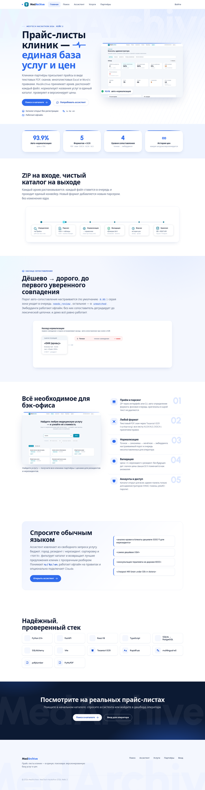 | 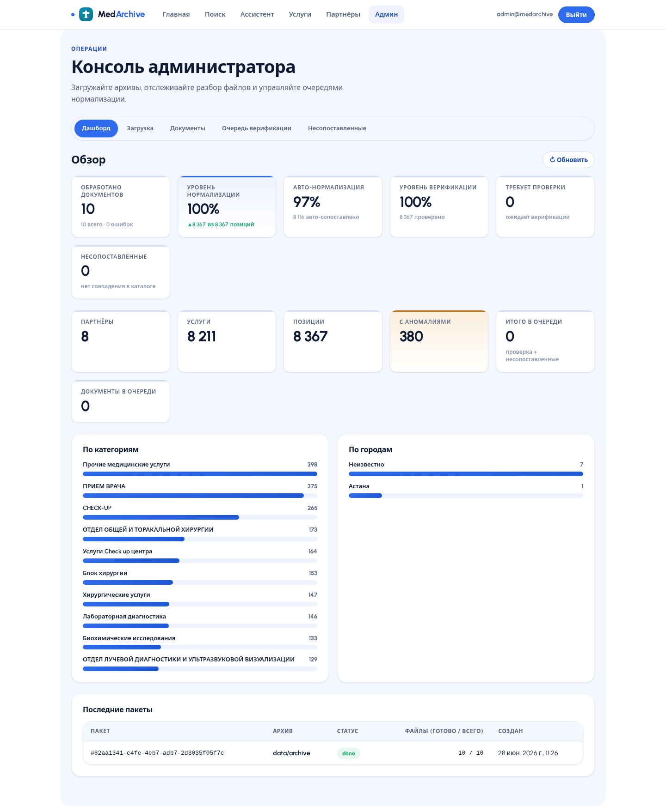 |
| **Marketing landing** — one paragraph, one promise | **Admin console** — quality metrics at a glance |

---

## 🩹 The problem

Healthcare aggregators work with dozens of partner clinics, and **every clinic is its own data format**:

- A price-list might be a clean PDF table — or a **photo/scan** of a printout.
- Excel files have headers in random rows, several sheets, merged cells.
- Word documents arrive with **tracked changes** still in them.
- "CBC", "Общий анализ крови", "ОАК" are the *same test* under three names.
- Prices are in ₸, sometimes USD; they change month to month.

Doing this by hand doesn't scale, and the moment you stop, the catalogue is stale.

---

## 🛠 What we built

A full pipeline + product, end to end:

1. **Ingest** — drop a `.zip` of price-lists (or POST to the API). Each file is queued and processed by a background worker.
2. **Parse** — format auto-detection routes each file to the right parser: PDF text+tables, **scanned PDF → OCR** (Tesseract `rus+kaz+eng`), XLSX/XLS (all sheets, header-finding heuristics), **DOCX with tracked changes accepted**.
3. **Normalize** — a 4-stage cascade maps each raw service name onto the reference catalogue: **exact → synonyms → fuzzy (RapidFuzz) → embeddings (multilingual-e5)**. Stops at the first confident match; the grey zone goes to a review queue, the rest to "unmatched".
4. **Validate & version** — price > 0, non-resident ≥ resident, date not in the future, **>50% jump flagged as an anomaly**; currency converted to ₸ at the price-list's date; **full price history kept forever** (new version active, old archived).
5. **Serve** — REST API (OpenAPI/Swagger) + a React web app: search, service→partners comparison, partner price-lists, a **natural-language assistant**, and an **operator admin console**.

The core only talks to **interfaces** (`BaseParser`, `MatchResult`, `ValidationOutcome`), so **a new file format is a new parser — no changes to the engine.**

---

## 🧭 Product tour

### Public side — anyone can search

#### 🔎 Search
Type any service or clinic; instant results from the parsed catalogue.

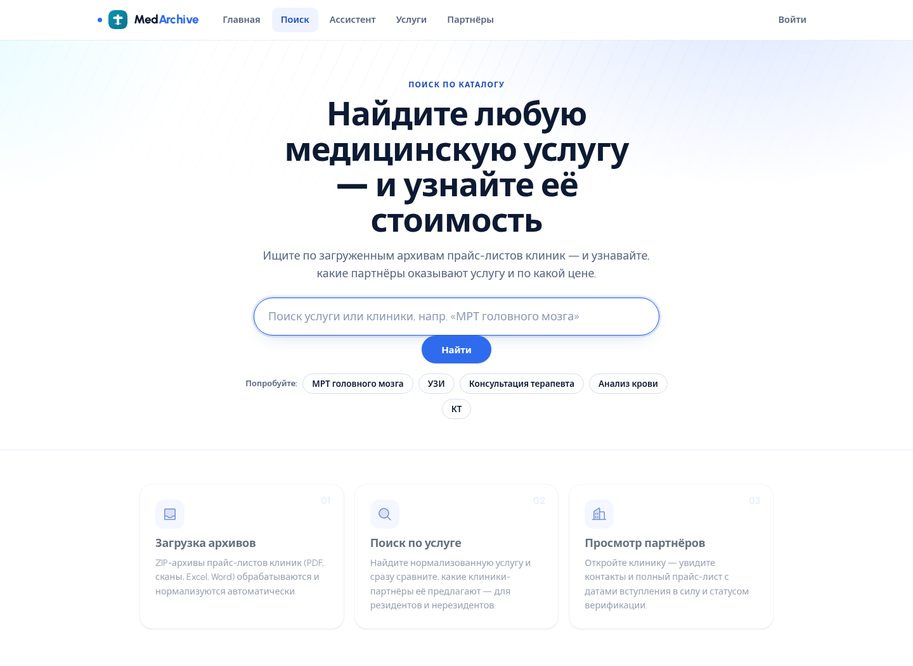

#### 🗂 Services catalogue
**8 211 normalized services across 472 categories**, grouped and expandable, each with its ICD code and synonyms.

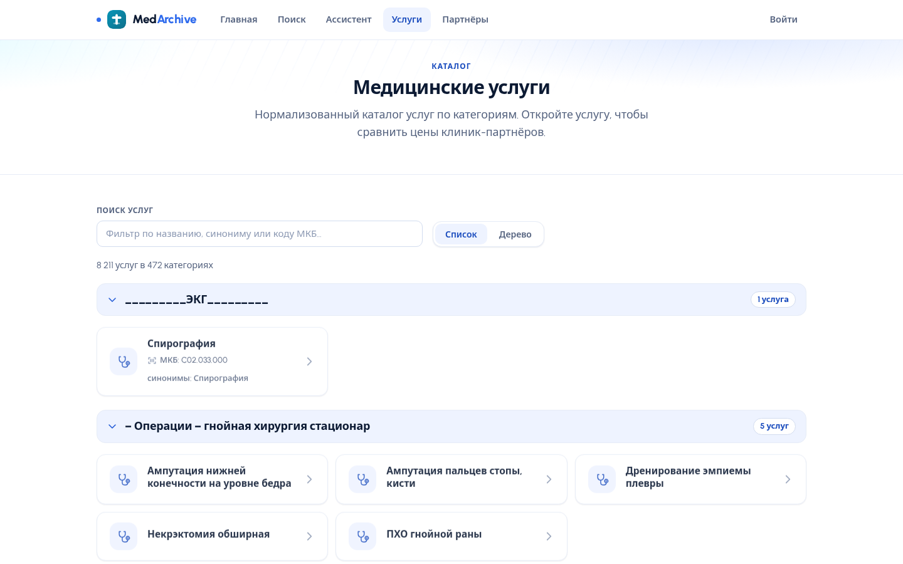

#### 💊 Service → partner comparison (with price history)
Pick a service and see **every clinic that offers it**, side by side: resident / non-resident price, effective date, match-confidence, verification status — plus a **price-over-time chart** with an anomaly marker.

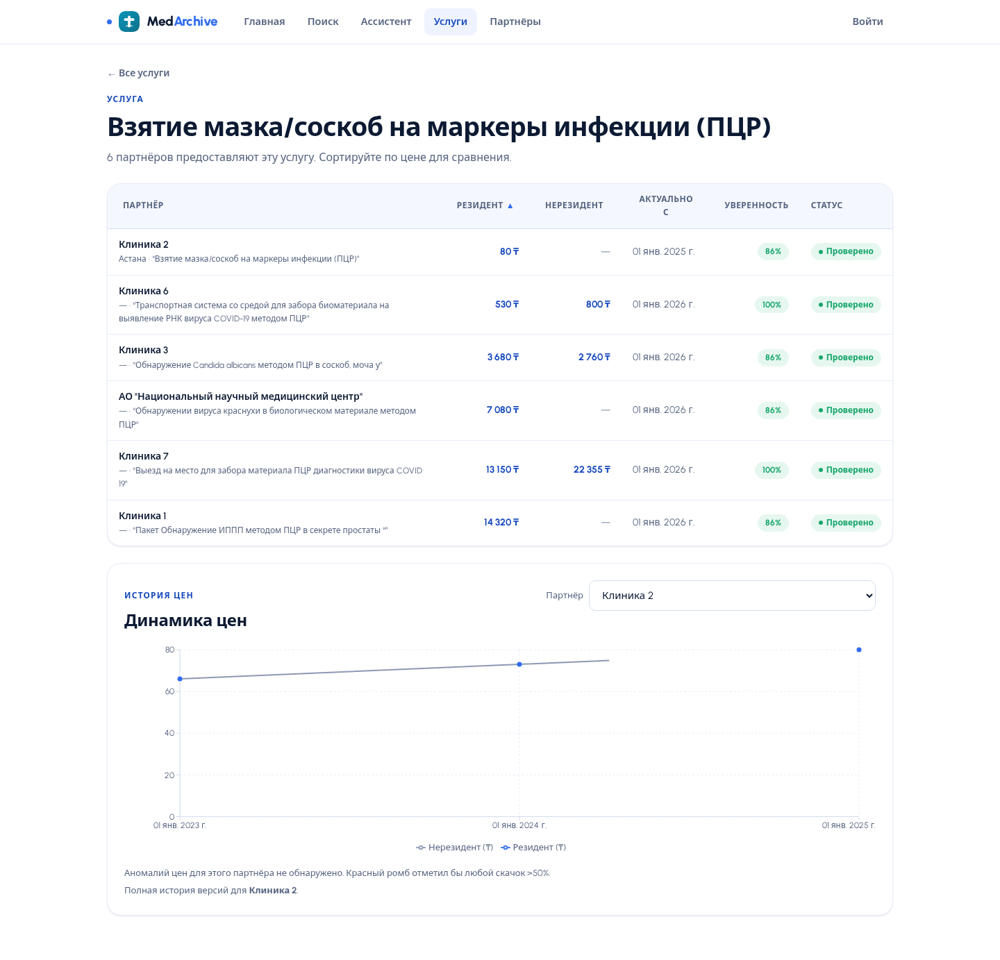

#### 🏢 Partner clinics
All clinics whose price-lists were ingested. Note **real organisation names are recovered where present** ("АО Национальный научный медицинский центр") and the city pin (📍 Астана).

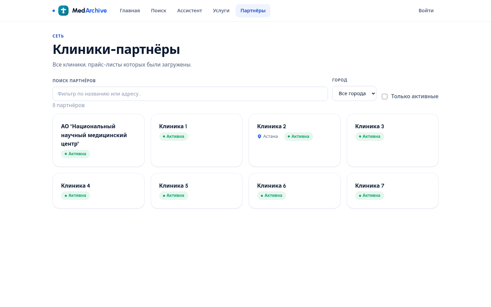

#### 🤖 AI assistant (natural language → results)
Ask in plain Russian / Kazakh / English — *"cheapest ultrasound"*, *"blood test under 5000 ₸ for a non-resident"*. The assistant extracts **service · budget · city · resident type · sort · top-N**, filters the catalogue, and returns **ranked clinics with the best offers** — and shows *how* it understood you ("РАСПОЗНАНО: узи · Дешевле"). Works **offline, rule-based, no API key**; upgrades to Claude automatically if `ANTHROPIC_API_KEY` is set.

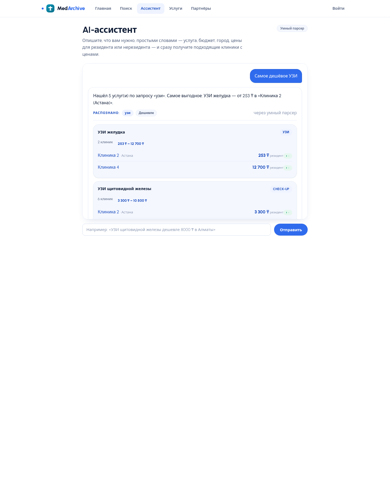

#### 🔐 Accounts
Public search for everyone; the admin console is gated behind login.

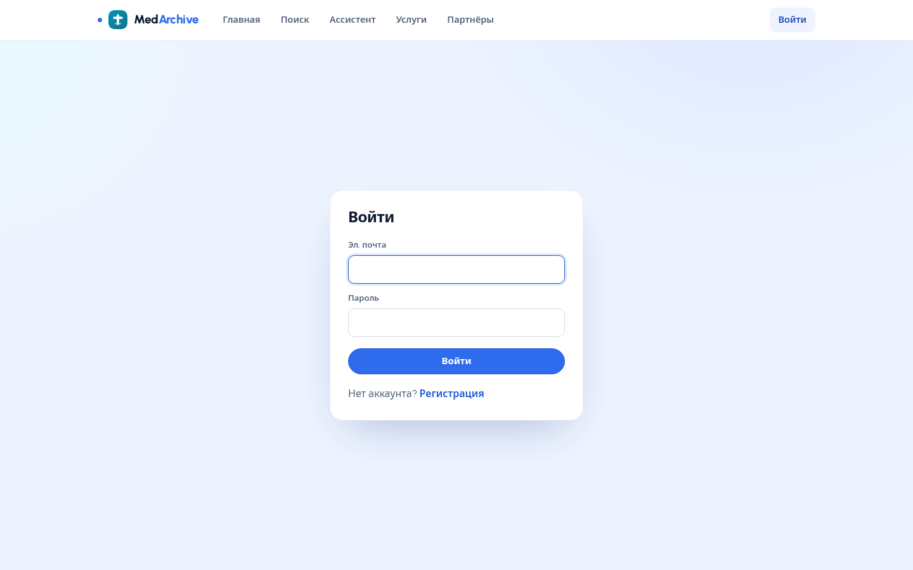

### Admin side — for operators

#### 📊 Dashboard
The single source of truth for data quality: documents processed, normalization & verification rates, queue sizes, anomalies, and distributions by category and city.


#### 📥 Upload
Drag a `.zip` of price-lists or import the reference service catalogue (XLSX/JSON).

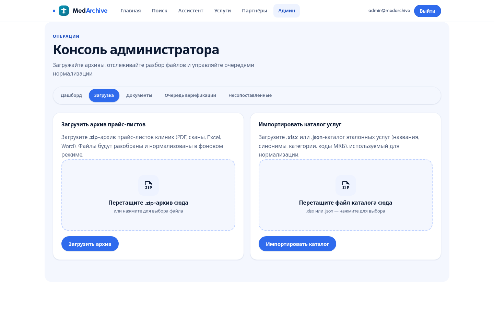

#### 📄 Documents
Per-file processing status across all formats — matched / total positions, language, effective date, processed time.

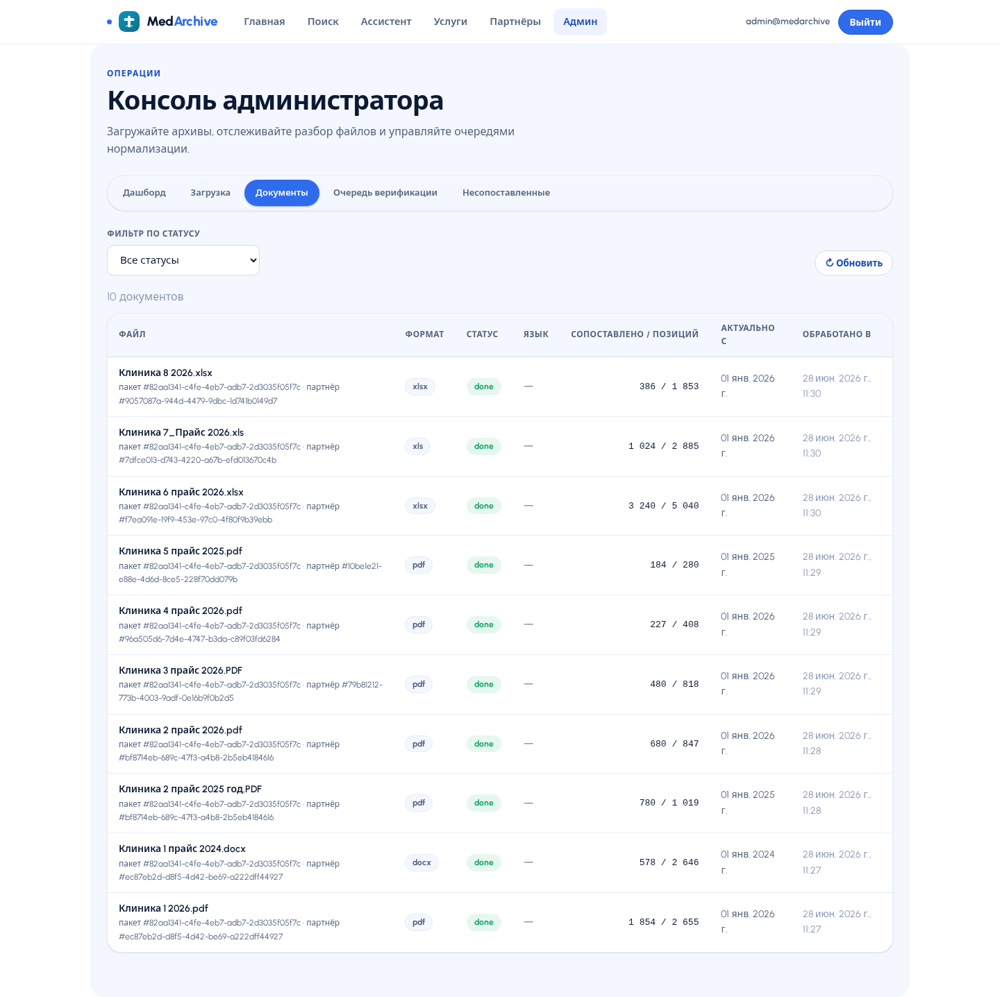

#### ✅ Verification & 🧩 Unmatched queues
Where operators confirm grey-zone matches and hand-map anything the cascade couldn't place. In the demo, **both queues are at zero** — everything has been normalized and verified.

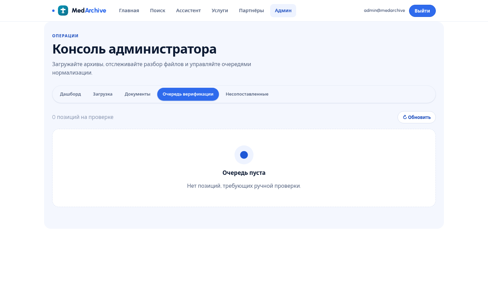

---

## 🧠 The hard part — the normalization cascade

Each raw price-list line runs a **cheap → expensive** cascade and **stops at the first confident match**. The auto-match threshold is configurable (`MATCH_AUTO_THRESHOLD`, default **0.85**).

| Stage | Method | Fires when |
|--|--|--|
| 1 · **Exact** | normalized string equality | identical names |
| 2 · **Synonym** | synonym dictionary from the catalogue | "ОАК" → "Общий анализ крови" |
| 3 · **Fuzzy** | RapidFuzz token-set ratio | typos, reordered words |
| 4 · **Embedding** | multilingual-e5 cosine similarity | semantic match across ru / kz |

Embeddings load **offline** from a local cache; without it the matcher degrades gracefully to the lexical chain, so the demo always runs.

---

## 🏗 Architecture

```
ZIP archive
   │  detect format
   ├─ pdf        → pdf_text (text + tables)
   ├─ scan       → pdf_scan · OCR (Tesseract rus+kaz+eng)
   ├─ docx       → docx (tracked changes accepted)
   └─ xlsx / xls → sheet + header heuristics
        │
        ▼
   normalize  (exact · synonym · fuzzy · embedding)
        ▼
   validate (§4.4) + currency → ₸
        ▼
   version (price history, never deleted)
        ▼
   DB  (SQLite dev → PostgreSQL prod)
        ▼
   REST API · OpenAPI ──► React web app (search · admin · dashboard · assistant)
```

| Layer | Package | Responsibility |
|--|--|--|
| Parsers | `app/parsers/` | detect · pdf_text · pdf_scan (OCR) · xlsx · docx · table_extract |
| Normalization | `app/normalization/` | catalog · matcher (4-stage) · embeddings |
| Validation | `app/validation/` | validators · currency · versioning |
| Ingestion | `app/ingestion/` | archive (ZIP) · partner dedup · pipeline · worker |
| API | `app/api/` | services · partners · search · assistant · admin |
| UI | `frontend/` | React + Vite + TanStack Query + Recharts |

---

## 🧰 Tech stack

| Area | Choice |
|--|--|
| **Backend / API** | FastAPI · Uvicorn · Pydantic v2 |
| **DB / ORM** | SQLAlchemy 2 · SQLite (dev) → PostgreSQL (prod) |
| **PDF** | pdfplumber · PyMuPDF |
| **OCR** | Tesseract (`rus+kaz+eng`) · Pillow |
| **DOCX / XLSX** | python-docx · openpyxl · xlrd · pandas |
| **Matching** | RapidFuzz · sentence-transformers (multilingual-e5) |
| **AI assistant** | rule-based parser (stdlib) · optional Anthropic Claude |
| **Frontend** | React 18 · Vite · TypeScript · TanStack Query · Recharts · Phosphor icons |
| **Design** | PulseIQ blue design system (Urbanist, custom token set) |
| **Auth** | HMAC-signed tokens · pbkdf2-sha256 passwords (no extra deps) |

---

## 📈 By the numbers

**Live demo database (what the screenshots show):**

| | |
|--|--|
| Partner clinics | **8** |
| Documents ingested | **10** (xlsx · xls · pdf · docx) |
| Parsed price positions | **8 367** |
| Normalized services | **8 211** across **472** categories |
| Auto-normalization | **97%** |
| Overall normalization | **100%** |
| Verified | **100%** |
| Anomaly flags raised | **380** |
| In review / unmatched queue | **0** |

**Engineering proof (real organizer archive, `make report`):**

| | |
|--|--|
| Formats handled | **5** + OCR + Word tracked changes |
| **Auto-normalization** | **93.8%** &nbsp;✅ vs the **≥70%** requirement |
| Max parse time (text doc) | **0.02 s** (limit 60 s) ✅ |
| Max parse time (scan/OCR) | **2.06 s** (limit 180 s) ✅ |
| REST endpoints | **16** (OpenAPI / Swagger) |
| Automated tests | **70** across 7 files |

> Both are true and measure different things: **93.8%** is what the matcher achieves on the genuine raw archive (the defensible technical metric); **97% / 100%** is the *current state* of the fully-populated demo catalogue.

---

## ✍️ Ready-to-post drafts

**Short (X / Twitter):**

> We built **MedArchive** for MedTech Hackathon 2026 🏥
> Drop a ZIP of clinic price-lists — PDFs, scans, Excel, Word — and it auto-extracts every service + price, maps them to one catalogue, validates, versions the price history, and serves a searchable web app + REST API + an AI assistant.
> 8 clinics → 8 367 prices → 97% auto-matched, 100% verified.
> FastAPI · React · Tesseract OCR · RapidFuzz · embeddings.

**Medium (LinkedIn / Devpost):**

> **MedArchive — turning messy clinic price-lists into one clean, versioned catalogue.**
>
> Healthcare aggregators get price-lists from every partner clinic in a different shape: text PDFs, scanned printouts, multi-sheet Excel, Word with tracked changes — different currencies, different names for the same test. Merging that by hand doesn't scale.
>
> For MedTech Hackathon 2026 (Case #2) we built a full pipeline + product that does it automatically:
> • **Parsing** — 5 formats incl. scanned-PDF OCR (rus+kaz+eng) and Word tracked-changes.
> • **Normalization** — a 4-stage cascade (exact → synonyms → fuzzy → multilingual embeddings) hitting **93.8% auto-match** vs a 70% target.
> • **Validation & versioning** — anomaly detection, currency conversion, full price history kept forever.
> • **Product** — REST API (OpenAPI), a React web app with service→clinic price comparison and trend charts, a natural-language AI assistant, and an operator admin console.
>
> Live demo: **8 clinics, 10 documents, 8 367 prices, 8 211 normalized services — 97% auto-matched, 100% verified, 0 left in the queue.**
>
> Stack: FastAPI · SQLAlchemy · React 18 + Vite + TypeScript · Tesseract · RapidFuzz · sentence-transformers.

---

<div align="center">

**MedArchive · MedTech Hackathon 2026 · Case #2 · Team 62**
Screenshots in [`assets/showcase/`](assets/showcase/) · full docs in [`README.md`](README.md) & [`docs/`](docs/) · `MIT License`

</div>
